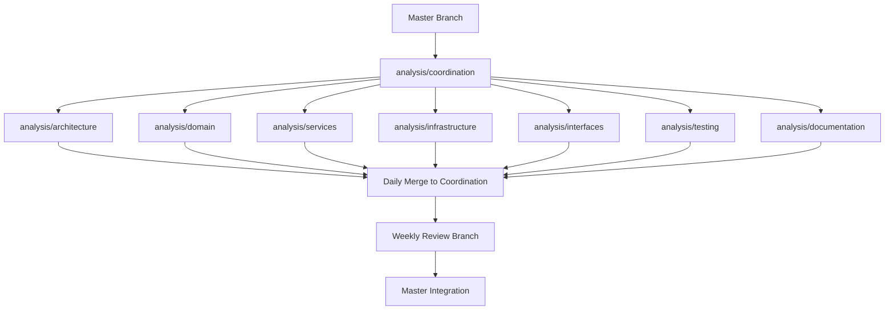

# Merge Strategy and Conflict Resolution Guide

## Merge Flow Diagram



## Detailed Merge Procedures

### 1. Agent Daily Merge Procedure

```bash
# Step 1: Agent completes daily work
git checkout analysis/[agent-area]
git add docs/analysis/[agent-area]/*
git commit -m "analysis([agent-area]): [specific work completed]"
git push origin analysis/[agent-area]

# Step 2: Create merge request
# Title: "Daily merge: [agent-area] - [date]"
# Description: List of completed analyses
```

### 2. Coordination Daily Consolidation

```bash
# Morning consolidation (9 AM)
git checkout analysis/coordination
git pull origin analysis/coordination

# Merge all agent branches
for branch in architecture domain services infrastructure interfaces testing documentation; do
    echo "Merging analysis/$branch..."
    git merge origin/analysis/$branch --no-ff -m "merge: daily $branch analysis $(date +%Y-%m-%d)"
done

# Resolve any conflicts
# Push consolidated work
git push origin analysis/coordination
```

### 3. Weekly Review Process

```bash
# Create weekly review branch
WEEK_NUM=$(date +%U)
git checkout analysis/coordination
git checkout -b review/week-$WEEK_NUM

# Generate weekly summary
cat > docs/analysis/weekly-reports/week-$WEEK_NUM-summary.md << EOF
# Week $WEEK_NUM Analysis Summary
Generated: $(date)

## Completed Analyses
[Auto-generated from commits]

## Key Findings
[Consolidated from agent reports]

## Action Items
[Issues requiring immediate attention]
EOF

git add docs/analysis/weekly-reports/*
git commit -m "review: week $WEEK_NUM summary and consolidation"
git push -u origin review/week-$WEEK_NUM
```

### 4. Master Integration Process

```bash
# Only after review approval
git checkout master
git pull origin master

# Merge review branch
git merge review/week-$WEEK_NUM --no-ff -m "feat(analysis): integrate week $WEEK_NUM analysis

Summary:
- [List major findings]
- [List resolved issues]
- [List pending items]

Reviewed-by: [Agent names]
Approved-by: [Admin name]"

# Tag the release
git tag -a "analysis-week-$WEEK_NUM" -m "Analysis milestone: Week $WEEK_NUM completed"

# Push with tags
git push origin master --tags
```

## Conflict Resolution Matrix

| Conflicting Agents | Priority | Resolution Authority | Documentation Required |
|-------------------|----------|---------------------|----------------------|
| Architecture vs Any | Architecture wins | Architecture Agent | Rationale in ARCHITECTURE_DECISIONS.md |
| Domain vs Services | Domain wins | Domain Agent | Update in DOMAIN_RULES.md |
| Services vs Infrastructure | Services wins | Service Agent | Note in SERVICE_CONTRACTS.md |
| Infrastructure vs Interfaces | Interfaces win | Interface Agent | Document in INTERFACE_SPECS.md |
| Any vs Documentation | Source wins | Source Agent | Update documentation accordingly |

## Automated Conflict Detection

### Pre-merge Checks
```bash
#!/bin/bash
# pre-merge-check.sh

BRANCH=$1
CONFLICTS=$(git merge-tree $(git merge-base HEAD $BRANCH) HEAD $BRANCH | grep -c "<<<<<<< ")

if [ $CONFLICTS -gt 0 ]; then
    echo "⚠️  Potential conflicts detected: $CONFLICTS"
    echo "Run detailed conflict analysis..."
    git merge --no-commit --no-ff $BRANCH
    git status --porcelain | grep "^UU"
    git merge --abort
fi
```

### Conflict Categories

#### 1. **Structural Conflicts**
- Different architectural interpretations
- Resolution: Architecture agent has final say
- Example:
  ```python
  # Agent A interpretation
  class UserService(ApplicationService):  # Application layer
  
  # Agent B interpretation  
  class UserService(DomainService):  # Domain layer
  
  # Resolution: Follow architecture agent's layer assignment
  ```

#### 2. **Semantic Conflicts**
- Same code, different analysis conclusions
- Resolution: Both views documented, higher-priority agent's view is primary
- Example in analysis files:
  ```markdown
  <!-- architecture/analysis.md -->
  ## UserService Analysis
  - **Primary View**: Application Service (Architecture Agent)
  - **Alternative View**: Domain Service (Domain Agent)
  - **Rationale**: [Detailed explanation]
  ```

#### 3. **Documentation Conflicts**
- Overlapping documentation updates
- Resolution: Merge both, documentation agent consolidates
- Tool: Custom merge driver for .md files

## Merge Automation Scripts

### 1. Daily Merge Script
```bash
#!/bin/bash
# daily-merge.sh

LOG_FILE="merge-log-$(date +%Y%m%d).txt"
BRANCHES="architecture domain services infrastructure interfaces testing documentation"

echo "Starting daily merge: $(date)" | tee -a $LOG_FILE

git checkout analysis/coordination
git pull origin analysis/coordination

for branch in $BRANCHES; do
    echo "Merging $branch..." | tee -a $LOG_FILE
    if git merge origin/analysis/$branch --no-ff -m "merge: daily $branch $(date +%Y-%m-%d)"; then
        echo "✅ $branch merged successfully" | tee -a $LOG_FILE
    else
        echo "❌ $branch has conflicts" | tee -a $LOG_FILE
        # Auto-resolve based on priority
        # ... conflict resolution logic
    fi
done

git push origin analysis/coordination
```

### 2. Weekly Review Script
```bash
#!/bin/bash
# weekly-review.sh

WEEK=$(date +%U)
YEAR=$(date +%Y)

# Create review branch
git checkout analysis/coordination
git checkout -b review/$YEAR-week-$WEEK

# Generate reports
python3 scripts/generate_weekly_report.py > docs/analysis/weekly-reports/week-$WEEK-report.md

# Create PR
gh pr create \
  --title "Weekly Review: $YEAR Week $WEEK" \
  --body "$(cat docs/analysis/weekly-reports/week-$WEEK-report.md)" \
  --reviewer "architecture-agent,domain-agent" \
  --label "weekly-review"
```

## Merge Quality Gates

### Pre-merge Checklist
- [ ] All tests passing
- [ ] No unresolved TODOs in analysis
- [ ] Documentation updated
- [ ] Tracking log current
- [ ] Peer review completed
- [ ] No conflicting analyses

### Post-merge Verification
```bash
# verify-merge.sh
#!/bin/bash

# Check file structure integrity
find docs/analysis -name "*.md" -exec grep -l "TODO\|FIXME\|XXX" {} \;

# Verify no broken references
grep -r "\[\[.*\]\]" docs/analysis | grep -v ".md"

# Check tracking log is updated
LAST_UPDATE=$(git log -1 --format=%cd docs/analysis/documentation/tracking_log.md)
TODAY=$(date +%Y-%m-%d)

if [[ "$LAST_UPDATE" != *"$TODAY"* ]]; then
    echo "⚠️  Tracking log not updated today"
fi
```

## Emergency Procedures

### Hotfix Process
```bash
# For critical findings that can't wait for normal merge cycle
git checkout master
git checkout -b hotfix/critical-finding-$(date +%Y%m%d)

# Make urgent changes
git add .
git commit -m "hotfix: [description of critical issue]"

# Direct to master with admin approval
git checkout master
git merge hotfix/critical-finding-$(date +%Y%m%d) --no-ff
git push origin master
```

### Rollback Procedure
```bash
# If a merge causes issues
git checkout master
git log --oneline -10  # Find the problematic merge

# Revert the merge
git revert -m 1 [merge-commit-hash]
git push origin master

# Notify all agents
echo "⚠️  Merge reverted: [reason]" | git notes add
```

## Communication During Merges

### Merge Notifications
```bash
# notify-merge.sh
WEBHOOK_URL="your-webhook-url"
BRANCH=$1
STATUS=$2

curl -X POST $WEBHOOK_URL \
  -H "Content-Type: application/json" \
  -d "{
    \"branch\": \"$BRANCH\",
    \"status\": \"$STATUS\",
    \"timestamp\": \"$(date)\",
    \"author\": \"$(git config user.name)\"
  }"
```

### Conflict Resolution Communication
1. Create issue for complex conflicts
2. Tag relevant agents
3. Document resolution in commit message
4. Update conflict resolution log

## Metrics and Monitoring

### Merge Success Rate
```bash
# Calculate weekly merge success rate
git log --format="%s" --since="1 week ago" | grep -c "^merge:" 
git log --format="%s" --since="1 week ago" | grep -c "^revert:"
```

### Conflict Frequency
Track which branches have most conflicts:
```bash
git log --format="%b" --since="1 month ago" | grep -c "Conflicts:"
```

---
*This document is part of the multi-agent analysis workflow. Update as patterns emerge.*