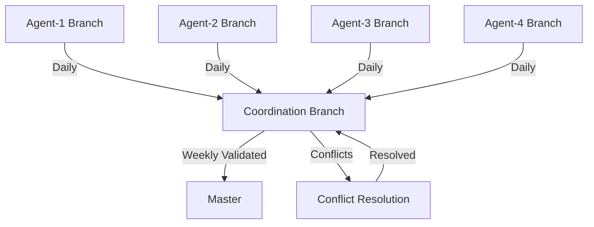

# 🔀 Enhanced Merge Strategy for Multi-Agent CAP Implementation

**Version**: 2.0  
**Updated**: 2025-07-09  
**Coordinator**: Agent-4  
**Status**: ACTIVE

## Overview

This enhanced merge strategy ensures safe, coordinated integration of work from multiple agents while maintaining code quality and preventing conflicts. The strategy implements a hierarchical merge flow with automated validation gates.

## Branch Hierarchy

```
master (protected)
    └── analysis/coordination (integration branch)
         ├── analysis/agent-1 (architecture/domain/core)
         ├── analysis/agent-2 (services/interfaces/utils)
         ├── analysis/agent-3 (infrastructure/testing)
         └── analysis/agent-4 (presentation/documentation)
```

## Merge Flow Diagram



## Daily Merge Protocol

### 1. Pre-Merge Checklist (Per Agent)
- [ ] All tests passing locally
- [ ] Linting and formatting complete
- [ ] Type checking passing
- [ ] Documentation updated
- [ ] Commit messages follow convention
- [ ] No merge conflicts with coordination branch

### 2. Merge Window Schedule
```
09:00 - 10:00: Agent-1 merge window
10:00 - 11:00: Agent-2 merge window  
11:00 - 12:00: Agent-3 merge window
14:00 - 15:00: Agent-4 merge window
15:00 - 16:00: Conflict resolution
16:00 - 17:00: Integration testing
```

### 3. Merge Commands Sequence

```bash
# For each agent (example for Agent-1)
git checkout analysis/agent-1
git pull origin analysis/agent-1
git fetch origin analysis/coordination
git merge origin/analysis/coordination

# Resolve any conflicts locally
# Run validation suite
make fmt && make lint && make type-check && make test

# Push to agent branch
git push origin analysis/agent-1

# Create merge to coordination
git checkout analysis/coordination
git pull origin analysis/coordination
git merge analysis/agent-1 --no-ff -m "[Coordination] Merge Agent-1 daily changes"
git push origin analysis/coordination
```

## Conflict Resolution Matrix

### Module Ownership
| Module | Primary Agent | Secondary Agent | Arbitrator |
|--------|---------------|-----------------|------------|
| Domain | Agent-1 | Agent-3 | Agent-4 |
| Infrastructure | Agent-3 | Agent-1 | Agent-4 |
| Application | Agent-2 | Agent-1 | Agent-4 |
| Presentation | Agent-4 | Agent-2 | Agent-1 |
| Testing | Agent-3 | All | Agent-4 |
| Documentation | Agent-4 | All | Agent-1 |

### Conflict Resolution Rules

1. **Same File, Different Sections**: Merge both changes
2. **Same File, Same Section**: 
   - Primary agent's changes take precedence
   - Document alternative approach in comments
   - Create follow-up task for reconciliation

3. **Import Conflicts**:
   - Alphabetize all imports
   - Group by: standard library, third-party, local
   - Use absolute imports from app root

4. **Type Definition Conflicts**:
   - More specific type wins
   - Document type decision in module docstring

5. **Test Conflicts**:
   - Keep all tests (no test deletion)
   - Rename if necessary with agent suffix

## Automated Validation Gates

### Pre-Merge Validation
```yaml
validation:
  - black --check .
  - isort --check .
  - ruff check .
  - mypy .
  - pytest tests/unit
  - pytest tests/integration -m "not slow"
```

### Post-Merge Validation
```yaml
validation:
  - Full test suite
  - Security scan
  - Dependency check
  - Documentation build
  - GraphQL schema validation
```

## Commit Message Standards

### Format
```
[Role] Action summary (ISSUE-ID)

- Detailed change description
- Impact on other modules
- Breaking changes noted

Co-authored-by: Agent-N <agent@ai>
```

### Examples
```
[Architecture] Refactor domain aggregates for CAP compliance (ISSUE-3)

- Split User aggregate into focused contexts
- Extract business logic from services
- No breaking changes to public interfaces

Co-authored-by: Agent-1 <agent1@ai>
```

## Merge Conflict Escalation

### Level 1: Agent Resolution (15 min)
- Agents attempt to resolve directly
- Use ownership matrix for guidance
- Document resolution approach

### Level 2: Coordinator Mediation (30 min)
- Agent-4 reviews conflict
- Consults with involved agents
- Makes architectural decision

### Level 3: Rollback and Redesign (1 hour)
- Revert problematic changes
- Create design document
- Implement agreed solution

## Weekly Master Merge

### Criteria for Master Merge
- [ ] All CAP issues for week resolved
- [ ] Full test suite passing
- [ ] Security scan clean
- [ ] Performance benchmarks met
- [ ] Documentation complete
- [ ] No outstanding conflicts

### Master Merge Process
```bash
# From coordination branch
git checkout analysis/coordination
git pull origin analysis/coordination

# Create release tag
git tag -a "cap-week-1" -m "CAP Implementation Week 1"

# Merge to master
git checkout master
git pull origin master
git merge analysis/coordination --no-ff -m "[CAP] Week 1 implementation complete"

# Run production validation
make prod-check

# Push if successful
git push origin master --tags
```

## Emergency Procedures

### Broken Build Recovery
1. **Immediate**: Revert breaking commit
2. **Notify**: Alert all agents via designated channel
3. **Fix**: Create hotfix branch from last known good
4. **Test**: Run full validation suite
5. **Merge**: Fast-track merge with dual agent approval

### Conflict Storm (3+ agents conflicting)
1. **Freeze**: Stop all merges
2. **Analyze**: Map conflict dependencies
3. **Sequence**: Create merge order based on dependencies
4. **Execute**: Merge one at a time with validation

## Metrics and Monitoring

### Daily Metrics
- Merge success rate
- Conflict frequency by module
- Resolution time average
- Test failure rate post-merge

### Weekly Metrics
- CAP issues resolved
- Code coverage change
- Performance impact
- Technical debt introduced/removed

## Best Practices

### DO:
- ✅ Pull latest coordination before starting work
- ✅ Make focused, atomic commits
- ✅ Run local validation before pushing
- ✅ Communicate merge intentions in advance
- ✅ Document complex conflict resolutions

### DON'T:
- ❌ Force push to shared branches
- ❌ Merge without running tests
- ❌ Delete others' code without discussion
- ❌ Ignore merge windows
- ❌ Accumulate large uncommitted changes

## Tool Integration

### Git Hooks (Pre-commit)
```bash
#!/bin/bash
make fmt
make lint
make type-check
```

### CI/CD Integration
- Automated validation on push
- Merge request creation
- Conflict detection alerts
- Test result notifications

## Communication Channels

### Merge Notifications
- **Channel**: #cap-merges
- **Format**: "[Agent-N] Merging to coordination: <summary>"
- **Conflicts**: "@coordinator Conflict in <file>: <description>"

### Daily Summary
- **Time**: 17:00
- **Content**: Merge summary, conflicts resolved, outstanding issues
- **Owner**: Agent-4 (Coordinator)

---

**Document Status**: Living document, updates as needed  
**Review Frequency**: Daily during CAP implementation  
**Next Review**: 2025-07-10